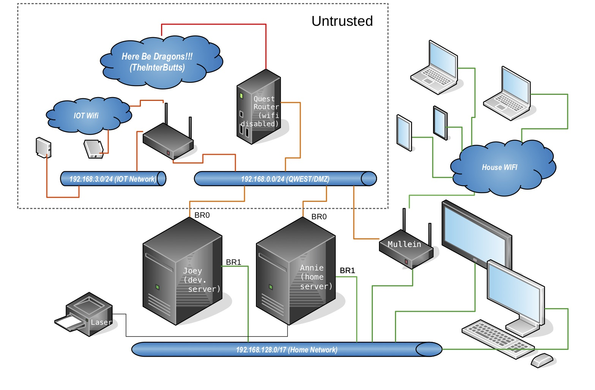

# Joey Rebuild #
An edgy server. Joey has 3 main jobs. Stage web content to be pushed or synced to external servers. Provide replication for the lan file servers disks. Provide container space both for lan/wan/edge services and to back up those provided by the file server.
   
## Ubuntu 20.04 + zfs root on the Hp z400.
Someday this will not be so hard :)
As much as I like this little workhorse the bios on it kind of sucks. No UEFI. No booting from the on board raid. No booting from the external raid controller.

Tried to install the zfs root but the current installer only works with UEFI based bios's but much like the 18.04 install using the half baked on board controller it installs just fine but won't boot. So like the last install I just installed a minimal system and enough zfs tools to detect the installation and let grub find it. (then edit /etc/grub/default to boot to the zfs option and update-grub)

Then I added the mirror partitions. I didn't bother with the boot partitions on the mirror disk since they didn't work anyway. 

Disk Layout.

### linkdump
* [https://openzfs.github.io/openzfs-docs/Getting%20Started/Ubuntu/Ubuntu%2020.04%20Root%20on%20ZFS.html#rescuing-using-a-live-cd](https://openzfs.github.io/openzfs-docs/Getting%20Started/Ubuntu/Ubuntu%2020.04%20Root%20on%20ZFS.html#rescuing-using-a-live-cd)
* [https://gist.github.com/yorickdowne/a2a330873b16ebf288d74e87d35bff3e](https://gist.github.com/yorickdowne/a2a330873b16ebf288d74e87d35bff3e)
* [https://saveriomiroddi.github.io/Installing-Ubuntu-on-a-ZFS-root-with-encryption-and-mirroring/#cloning-the-efi-partition](https://saveriomiroddi.github.io/Installing-Ubuntu-on-a-ZFS-root-with-encryption-and-mirroring/#cloning-the-efi-partition)
* [https://www.reddit.com/r/linuxadmin/comments/j8qzdq/install_ubuntu_server_2004_on_a_zfs_root/](https://www.reddit.com/r/linuxadmin/comments/j8qzdq/install_ubuntu_server_2004_on_a_zfs_root/)
* [https://www.medo64.com/2020/04/installing-uefi-zfs-root-on-ubuntu-20-04/](https://www.medo64.com/2020/04/installing-uefi-zfs-root-on-ubuntu-20-04/)

##### lxd setup.
* https://linuxcontainers.org/lxd/docs/master/storage

```
... snap install lxd --channel=4.0/stable
root@joey:/home/don# apt-get install lxd
...
root@joey:/home/don# lxd init
Would you like to use LXD clustering? (yes/no) [default=no]: 
Do you want to configure a new storage pool? (yes/no) [default=yes]: 
Name of the new storage pool [default=default]: devil
Name of the storage backend to use (dir, lvm, zfs, ceph, btrfs) [default=zfs]: 
Would you like to create a new zfs dataset under rpool/lxd? (yes/no) [default=yes]: no
Create a new ZFS pool? (yes/no) [default=yes]: 
Would you like to use an existing empty block device (e.g. a disk or partition)? (yes/no) [default=no]: yes
Path to the existing block device: /dev/sdc2
Would you like to connect to a MAAS server? (yes/no) [default=no]: 
Would you like to create a new local network bridge? (yes/no) [default=yes]: no
Would you like to configure LXD to use an existing bridge or host interface? (yes/no) [default=no]: yes
Name of the existing bridge or host interface: br0
Would you like LXD to be available over the network? (yes/no) [default=no]: yes
Address to bind LXD to (not including port) [default=all]: 192.168.129.65
Port to bind LXD to [default=8443]: 
Trust password for new clients: 
Again: 
Would you like stale cached images to be updated automatically? (yes/no) [default=yes] 
Would you like a YAML "lxd init" preseed to be printed? (yes/no) [default=no]: yes
config:
  core.https_address: 192.168.129.65:8443
  core.trust_password: NOT_HERE
networks: []
storage_pools:
- config:
    source: /dev/disk/by-id/ata-TEAML5Lite3D240G_AB20190109A0101064-part2
  description: ""
  name: devil
  driver: zfs
profiles:
- config: {}
  description: ""
  devices:
    eth0:
      name: eth0
      nictype: bridged
      parent: br0
      type: nic
    root:
      path: /
      pool: devil
      type: disk
  name: default
cluster: null

```