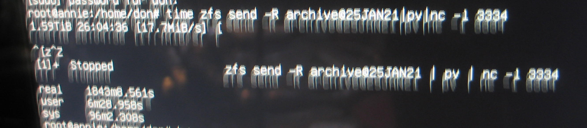

# Joey Rebuild #
Joey (ramone) is an edgy server. Joey has 3 main jobs. Stage web content to be pushed or synced to external servers. Provide disk replication for the lan file servers. Provide container space both for lan/wan/edge services and to back up those provided by the file server.
   
## Ubuntu 20.04 + zfs root on the Hp z400.
Someday this will not be so hard :)
As much as I like this little workhorse the bios on it kind of sucks. No UEFI. No booting from the on board raid. No booting from the external raid controller.

The current desktop installer can install zfs boot and root disks. It only works with UEFI based bios's but (much like the 18.04 install using the half baked on board psudo-raid controller) <em>it doesnt notice that your system doesnt support UEFI</em>.  It installs just fine but won't boot. So like the last install I just installed a minimal system and enough zfs tools to detect the installation and let grub find it. (then edit /etc/grub/default to boot to the zfs option and update-grub)

```
... booting from minimal ...
# nano /etc/default/grub
...
GRUB_DEFAULT=2
#GRUB_TIMEOUT_STYLE=hidden
GRUB_TIMEOUT=5
GRUB_DISTRIBUTOR=`lsb_release -i -s 2> /dev/null || echo Debian`
GRUB_CMDLINE_LINUX_DEFAULT="verbose"
GRUB_CMDLINE_LINUX="text"
# update-grub
# reboot
```

While your fixing things get rid of the graphical desktop.

```
... booting from zfs installation ...
root@joey:/# systemctl set-default multi-user.target

```

Then I added the mirror partitions. I didn't bother with the boot partitions on the mirror disk since they didn't work anyway. And I won't bother documenting it because..... 

### .....FUUUUUUU...... at that point I realized I needed to make space for the containers.
Since the installer only accepted a disk name for the zfs install it took the entire disk. Fortunately we are running zfs. 
Booting from our minimal install we can break the mirrors we just created and then use the extra disks to recreate a smaller boot disk. (Note: root and boot pools were on sde and sdc at this point).
#### shrinking a zfs pool 
``` 
zpool detach ata-TEAML5Lite3D240G_AB20190109A0101064-part6
zpool export rpool
zpool import rpool oldrpool

mkdir /oldroot /newroot
fdisk /dev/sde
.... delete partition six and split it into 2 new partitions ....
ls -lsa /dev/disk/by-id/|grep sde7
zpool create rpool ata-TEAML5Lite3D240G_AB20190109A0101064-part7
zpool export oldrpool
zpool import -R/oldroot oldrpool
zpool export rpool
zpool import -R/newroot rpool
zfs snapshot -r oldrpool@for_copy
zfs send -R oldrpool@for_copy | zfs recv -F rpool
zpool list
zpool export oldrpool
```

##### move boot pool to second disk.
```
ls -ls /dev/disk/by-partuuid/|grep sde6
zpool attach bpool ata-TEAML5Lite3D240G_AB20190109A0101064-part6
zpool status bpool
(... wait for resliver to complete ...)
zpool detach bpool d3bff208-06
```
##### copy partitions from edited disk
```
sgdisk -p /dev/sde
sgdisk -R/dev/sdc /dev/sde
sgdisk -G /dev/sdc
partprobe
```
##### remirror to smaller partition
```
ls -ls /dev/disk/by-partuuid/|grep sdc6
zpool attach bpool ata-TEAML5Lite3D240G_AB20190109A0101064-part6 ata-Crucial_CT240M500SSD1_132909461FE4-part6
ls -ls /dev/disk/by-partuuid/|grep sdc7
zpool attach rpool ata-TEAML5Lite3D240G_AB20190109A0101064-part7 ata-Crucial_CT240M500SSD1_132909461FE4-part7 -o ashift=9
zpool export rpool
zpool import -R/ rpool
zpool status
(... wait for reslivers to complete ...)
update-grub
reboot

```

### Disk Layout. 

* SSDs

id | size | purpose
---|---|---
ata-Crucial_CT240M500SSD1_132909461FE4|240|bpool/rpool/devil
ata-TEAML5Lite3D240G_AB20190109A0101064|240|bpool/rpool/devil
ata-Corsair_Force_GT_1227792800001502028A|120|grub/maintainence disk


* Archive disks

id | size | purpose
---|---|---
ata-Hitachi_HDS5C3030ALA630_MJ1311YNG7RM5A|2.7T|/archive backup
scsi-3600508b1001c407672486f627337a3e9|1.8T|theflatfield/filebox backup
scsi-3600508b1001cca9043287e57e5adae22|1.8T|theflatfield/filebox backup
scsi-3600508b1001cfe22e99aade7378fb6c1|2.7T|/archive backup

### Network Configuration 
[etc/netplan/50-cloud-init.yaml](etc/netplan/50-cloud-init.yaml)

* br0 is the isp router side of the network and provides an anonymous bridge.
* br1 is the internal network and is configured to provide direct connection to the server. 

### Install ssacli to talk to the sas/raid controller
Like most vendor repositories hp's cant get the signature/otherdata right so we just trust them. (grrrrr)

```
echo deb [trusted=yes] https://downloads.linux.hpe.com/SDR/repo/mcp/ubuntu/ focal current/non-free >>/etc/apt/sources.list
apt-get update
apt-get install ssacli
```

## Task #3: Container space (LXD Installation and setup).

```
... snap install lxd --channel=4.0/stable
root@joey:/home/don# apt-get install lxd
...
root@joey:/home/don# lxd init
Would you like to use LXD clustering? (yes/no) [default=no]: 
Do you want to configure a new storage pool? (yes/no) [default=yes]: 
Name of the new storage pool [default=default]: devil
Name of the storage backend to use (dir, lvm, zfs, ceph, btrfs) [default=zfs]: 
Would you like to create a new zfs dataset under rpool/lxd? (yes/no) [default=yes]: no
Create a new ZFS pool? (yes/no) [default=yes]: 
Would you like to use an existing empty block device (e.g. a disk or partition)? (yes/no) [default=no]: yes
Path to the existing block device: /dev/disk/by-id/ata-TEAML5Lite3D240G_AB20190109A0101064-part2
Would you like to connect to a MAAS server? (yes/no) [default=no]: 
Would you like to create a new local network bridge? (yes/no) [default=yes]: no
Would you like to configure LXD to use an existing bridge or host interface? (yes/no) [default=no]: yes
Name of the existing bridge or host interface: br0
Would you like LXD to be available over the network? (yes/no) [default=no]: yes
Address to bind LXD to (not including port) [default=all]: 192.168.129.65
Port to bind LXD to [default=8443]: 
Trust password for new clients: 
Again: 
Would you like stale cached images to be updated automatically? (yes/no) [default=yes] 
Would you like a YAML "lxd init" preseed to be printed? (yes/no) [default=no]: yes
config:
  core.https_address: 192.168.129.65:8443
  core.trust_password: NOT_HERE
networks: []
storage_pools:
- config:
    source: /dev/disk/by-id/ata-TEAML5Lite3D240G_AB20190109A0101064-part2
  description: ""
  name: devil
  driver: zfs
profiles:
- config: {}
  description: ""
  devices:
    eth0:
      name: eth0
      nictype: bridged
      parent: br0
      type: nic
    root:
      path: /
      pool: devil
      type: disk
  name: default
cluster: null

```
### Restoring profiles and containers from lan file server.

```
root@annie:/home/don# lxc remote remove joey
root@annie:/home/don# lxc remote add joey
Certificate fingerprint: 2ad747d1305470bfd6787c1451e0ab64e22ab1798ae78d113718205763639742
ok (y/n)? yes
Admin password for joey: 
Client certificate stored at server:  joey
root@annie:/home/don# lxc profile copy infra joey:
root@annie:/home/don# lxc profile copy susdev20 joey:
root@annie:/home/don# lxc profile copy susdev21 joey:
root@annie:/home/don# lxc move nina joey:
root@annie:/home/don# lxc start joey:nina

```

## Task #2: Disk replication.

#### Investigate setting bridge networks mtu to 9000
Turns out none of the network adapters on board or cards support jumbo frames. 
May need to purchase new cards like the [asus nx1101](https://www.ebay.com/itm/Asus-NX1101-Gigabit-Ethernet-PCI-Network-Adapter-jumbo-frame/254641438776)

```
root@annie:/home/don# ip  -d link show
...
2: ens6: <BROADCAST,MULTICAST,UP,LOWER_UP> mtu 1500 qdisc fq_codel master br0 state UP mode DEFAULT group default qlen 1000
    link/ether 00:14:d1:25:2b:bc brd ff:ff:ff:ff:ff:ff promiscuity 1 minmtu 60 maxmtu 7152 
...
3: enp1s0: <BROADCAST,MULTICAST,UP,LOWER_UP> mtu 1500 qdisc mq master br1 state UP mode DEFAULT group default qlen 1000
    link/ether 78:e7:d1:c3:ef:9e brd ff:ff:ff:ff:ff:ff promiscuity 1 minmtu 60 maxmtu 1500 
...
root@joey:/home/don# ip -d link list
...
2: ens1: <BROADCAST,MULTICAST,UP,LOWER_UP> mtu 1500 qdisc mq master br0 state UP mode DEFAULT group default qlen 1000
    link/ether 00:10:18:1b:53:c0 brd ff:ff:ff:ff:ff:ff promiscuity 1 minmtu 60 maxmtu 1500 
...
3: enp1s0: <BROADCAST,MULTICAST,UP,LOWER_UP> mtu 1500 qdisc mq master br1 state UP mode DEFAULT group default qlen 1000
    link/ether d4:85:64:99:0e:89 brd ff:ff:ff:ff:ff:ff promiscuity 1 minmtu 60 maxmtu 1500 

```
#### transfer initial large disks from home server.
##### Smaller disks
Since we are on a private network we can send files in the clear. For small items this only takes a few hours.

* Source Machine

```
root@annie:# zfs snapshot -r filebox@26JAN21
root@annie:# time zfs send -R filebox@26JAN21|pv|nc -l 3333
```
* Destination machine

```
root@joey:# nc annie.local 3333|pv|zfs recv -Fdu filebox
```
##### Larger disk
The archive disk which has 1.6Tb of data required 30 hours to transfer. I have ordered a pair ofjumbo packet capable nics. In theory this should only need to be done once and then deltas can be sent. 


## Task #1: Edgy services.

* pihole
* squid
* web server with afs share.

YOU ARE HERE!!!!

### linkdump
* [https://openzfs.github.io/openzfs-docs/Getting%20Started/Ubuntu/Ubuntu%2020.04%20Root%20on%20ZFS.html#rescuing-using-a-live-cd](https://openzfs.github.io/openzfs-docs/Getting%20Started/Ubuntu/Ubuntu%2020.04%20Root%20on%20ZFS.html#rescuing-using-a-live-cd)
* [https://gist.github.com/yorickdowne/a2a330873b16ebf288d74e87d35bff3e](https://gist.github.com/yorickdowne/a2a330873b16ebf288d74e87d35bff3e)
* [https://saveriomiroddi.github.io/Installing-Ubuntu-on-a-ZFS-root-with-encryption-and-mirroring/#cloning-the-efi-partition](https://saveriomiroddi.github.io/Installing-Ubuntu-on-a-ZFS-root-with-encryption-and-mirroring/#cloning-the-efi-partition)
* [https://www.reddit.com/r/linuxadmin/comments/j8qzdq/install_ubuntu_server_2004_on_a_zfs_root/](https://www.reddit.com/r/linuxadmin/comments/j8qzdq/install_ubuntu_server_2004_on_a_zfs_root/)
* [https://www.medo64.com/2020/04/installing-uefi-zfs-root-on-ubuntu-20-04/](https://www.medo64.com/2020/04/installing-uefi-zfs-root-on-ubuntu-20-04/)

